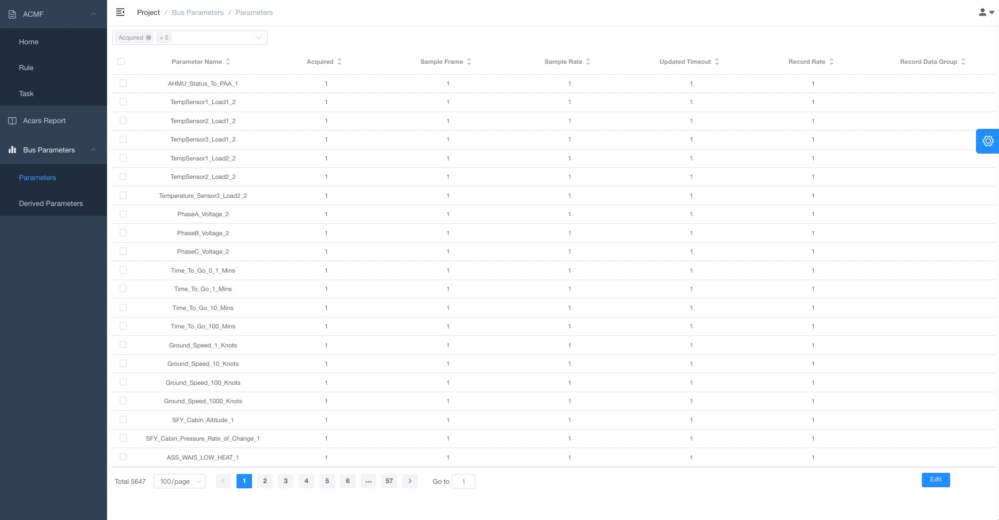
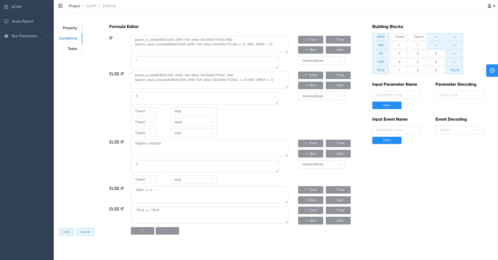

# ACMT_Tools

## 项目简介

ACMT Tools 是一个针对 ACMT 的集成应用系统，包含前端、后端和数据库组件，旨在为用户提供 ACARS 报文生成和用户管理等工具支持。

## 主要功能

- ACARS Report 及 Parameters、Derived Parameters、Rules、Tasks 等新建、公式编辑、参数配置、报文生成等业务。
- 用户管理&角色管理，并配置权限控制功能。




## 技术栈

- **后端**: Django
- **前端**: Vue
- **数据库**: MySQL

## 快速开始

### 运行环境要求

- Docker
- Docker Compose

### 启动项目

1. 确保你的机器上已安装了 Docker 和 Docker Compose。
2. 进入项目根目录：
   ```bash
   cd /path/to/ACMT_Tools
   ```
3. 启动 Docker 服务：
   ```bash
   docker-compose -f acmt_build_docker_compose.yml up
   ```
4. 访问前端：在浏览器中打开 [http://localhost:9527]（请根据 `docker-compose` 文件配置的端口进行访问）。

### 部署项目

如果您需要打包并部署本项目至 Linux 服务器环境中：

1. 由于内网 Linux 服务器架构为 `x86_64`，在您执行以下打包步骤时，请务必务必确保您的机器架构为 `x86_64`（ 64 位 Intel/AMD 架构），否则会导致打包文件无法运行。确保您的机器上已安装了 Docker 和 Docker Compose。
2. 进入项目根目录：
   ```bash
   cd /path/to/ACMT_Tools
   ```
3. 打包

   ```bash
   docker save -o acmt-django-app.tar acmt-django-app:latest
   docker save -o acmt-frontend-app.tar acmt-frontend-app:latest
   docker save -o mysql-8.0.tar mysql:8.0
   ```

4. 转移

   压缩本项目根目录，并复制压缩包` ACMT_Tools.zip` 到 Linux 服务器环境中并解压。

5. 启动 Docker 服务：

   ```bash
   docker load -i acmt-django-app.tar
   docker load -i acmt-frontend-app.tar
   docker load -i mysql-8.0.tar
   ```

6. 启动 Docker 服务：

   ```bash
   docker-compose -f acmt_deployment_docker_compose.yml up -d --build
   ```

7. 访问前端：

- 直接访问，在浏览器中打开 [http://10.11.53.158:9527]（请根据 `docker-compose` 文件配置的端口进行访问）。
- 在 FIDAB 中访问。（需另外单独部署前端打包文件 dist 至 FIDAB 环境中）

## 数据库配置

- 使用 `acmt.sql` 文件来初始化 MySQL 数据库。
- 数据库配置位于项目中的根目录下。

## 目录结构

```
.
├── README.md                       # 项目的概述和说明
├── acmt.sql                        # 数据库初始化脚本
├── acmt_build_docker_compose.yml   # 用于构建 Docker 容器的 Compose 文件
├── acmt_deployment_docker_compose.yml # 用于部署 Docker 容器的 Compose 文件
├── backend                          # 后端服务代码
│   ├── Dockerfile                   # 后端 Docker 构建文件
│   ├── README.md                    # 后端模块的说明
│   ├── application                  # 应用程序代码
│   ├── build                         # 构建相关文件
│   ├── conf                         # 配置文件
│   ├── del_migrations.py            # 删除迁移脚本
│   ├── docker_start.sh              # 用于启动 Docker 容器的脚本
│   ├── dvadmin                      # 后端管理界面
│   ├── gunicorn_conf.py             # Gunicorn 配置
│   ├── init_db.sql                  # 初始化数据库的 SQL 脚本
│   ├── logs                         # 日志文件
│   ├── main.py                      # 应用程序主入口
│   ├── manage.py                    # Django 管理工具
│   ├── manage.spec                  # PyInstaller 规范文件
│   ├── myenv                       # 虚拟环境
│   ├── plugins                      # 插件目录
│   ├── removeRepeat.py              # 删除重复项的脚本
│   ├── requirements.txt             # Python 依赖文件
│   ├── requirements_fake.txt        # 假数据的依赖文件
│   ├── static                       # 静态文件
│   └── templates                    # 模板文件
├── db                               # 数据库文件
│   ├── *.dblwr                      # InnoDB 日志文件
│   ├── auto.cnf                     # MySQL 自动配置
│   ├── binlog.*                     # 二进制日志文件
│   ├── mysql                         # MySQL 系统数据库
│   ├── ibdata1                      # InnoDB 数据文件
│   ├── mysql.sock                   # MySQL socket 文件
│   └── (其它数据库相关文件)
└── frontend                         # 前端服务代码
    ├── Dockerfile                   # 前端 Docker 构建文件
    └── dist                         # 前端构建输出目录
```

## 许可证

该项目遵循 [MIT 许可证](LICENSE)。

## 联系信息

如有疑问，请联系开发团队：zczlzco@gmail.com
